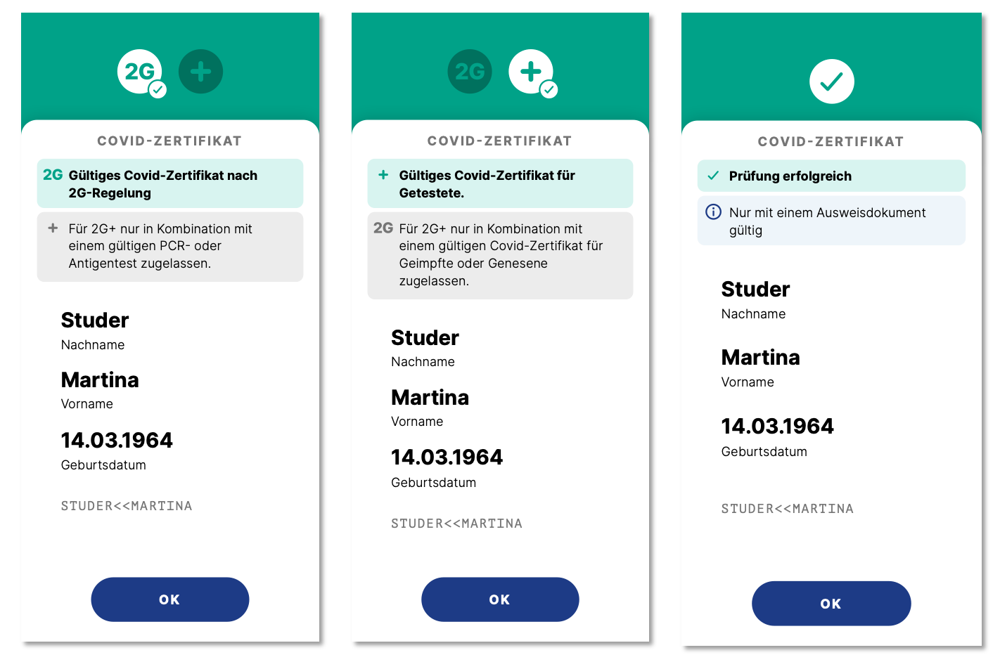

# CovidCertificate-SDK-Android

[](https://github.com/admin-ch/CovidCertificate-SDK-iOS/blob/main/LICENSE)
[](https://search.maven.org/search?q=g:%22ch.admin.bag.covidcertificate%22%20AND%20a:%22sdk-android%22)

## Introduction

This is the implementation of
the [Electronic Health Certificates (HCERT)](https://github.com/ehn-digital-green-development/hcert-spec)
and [Swiss Certificate Light](https://www.bag.admin.ch/bag/en/home/krankheiten/ausbrueche-epidemien-pandemien/aktuelle-ausbrueche-epidemien/novel-cov/covid-zertifikat.html#-518758716)
specification used to verify the validity of COVID
Certificates [in Switzerland](https://github.com/admin-ch/CovidCertificate-App-Android).

It is partially based on [these](https://github.com/ehn-digital-green-development/hcert-kotlin)
[two](https://github.com/DIGGSweden/dgc-java) implementations.

## Contribution Guide

This project is truly open-source and we welcome any feedback on the code regarding both the implementation and security aspects.

Bugs or potential problems should be reported using Github issues. We welcome all pull requests that improve the quality of the
source code.

## Repositories

* Android App: [CovidCertificate-App-Android](https://github.com/admin-ch/CovidCertificate-App-Android)
* iOS App: [CovidCertificate-App-iOS](https://github.com/admin-ch/CovidCertificate-App-iOS)
* iOS SDK: [CovidCertificate-SDK-iOS](https://github.com/admin-ch/CovidCertificate-SDK-iOS)
* Verifier Service: [CovidCertificate-App-Verifier-Service](https://github.com/admin-ch/CovidCertificate-App-Verifier-Service)
* For all others, see the [Github organisation](https://github.com/admin-ch/)

## Installation

For a change log, check out the [releases](https://github.com/admin-ch/CovidCertificate-SDK-Android/releases) page.

The latest release is available on [Maven Central](https://search.maven.org/artifact/ch.admin.bag.covidcertificate/sdk-android/).
```groovy
implementation 'ch.admin.bag.covidcertificate:sdk-android:1.2.0'
```

## Summary: How the SDK works

The SDK provides the functionality of decoding a QR code into an electronic health certificate and verifying the validity of the
decoded certificate. It also takes care of loading and storing the latest trust list information that is required for verification.
The trust list is a data model that contains a list of trusted public signing keys, a list of revoked certificate identifiers and
the currently active national rules. This trust list is loaded from a backend service. Refer to the "Verifier Service" listed in
the [Repositories](#repositories) section for more information.

### Decoding

Decoding a QR code into a COVID certificate uses the following steps. For more information, refer to
the [EHN specification](https://ec.europa.eu/health/sites/default/files/ehealth/docs/digital-green-certificates_v1_en.pdf).

1. Check the prefix of the data. Only `HC1:` (EU Dcc Certificate) and `LT1:` (CH Certificate Light) are valid prefixes
2. Base45 decode the data <sup> [[1]](https://datatracker.ietf.org/doc/draft-faltstrom-base45/) </sup>
3. ZLIB decompress the data
4. COSE decode the data <sup> [[2]](https://github.com/cose-wg/COSE-JAVA) </sup>
5. CBOR decode the data and parse it into a `CertificateHolder` containing either a `DccCert` or a `ChLightCert`

### Verification

The verification process consists of three parts that need to be successful in order for a certificate to be considered valid.

1. The certificate signature is verified against a list of trusted public keys from issueing countries
2. The UVCI (unique vaccination certificate identifier) is compared to a list of revoked certificates to ensure the certificate has
   not been revoked
3. The certificate details are checked based on the Swiss national rules for certificate validity. (Is the number of vaccination
   doses sufficient, is the test recent enough, how long ago was the recovery?)

## Usage: How to use the SDK

Once the SDK is added as a dependency, it needs to be initialized with an app token, a user agent and the application context.
This is preferably within your main Android Application class.
Please get in touch with the [BAG](mailto:Covid-Zertifikat@bag.admin.ch) to get a token assigned.

```kotlin
Config.appToken = "YOUR-APP-TOKEN"
Config.userAgent = UserAgentInterceptor.UserAgentGenerator { "YOUR-USER-AGENT" }

CovidCertificateSdk.init(applicationContext, SdkEnvironment.PROD)
```

After initialization, the SDK can also be registered with the application lifecycle to automatically update the trust list once
every hour when the app is in the foreground. This is useful for verifier applications that tend to be opened for a long period of
time.

```kotlin
// In your main activity
fun onCreate() {
	CovidCertificateSdk.registerWithLifecycle(lifecycle)
}

fun onDestroy() {
	CovidCertificateSdk.unregisterWithLifecycle(lifecycle)
}
```

If, for some reason, you suspect the locally stored trust list to be outdated, you can manually force a refresh by calling

```kotlin
CovidCertificateSdk.refreshTrustList(lifecycleScope, onCompletionCallback, onErrorCallback)
```

CovidCertificateSDK offers a Verifier and Wallet namespace for decoding and verification.
Methods in the Wallet namespace must only be used by the official COVID Certificate App.

### Decoding

Decoding takes the QR code data as a string and returns a decoding state object containing the decoded certificate in the success
case or error information in the failure case.

```kotlin
val decodeState = CovidCertificateSdk.Verifier.decode(qrCodeData)
when (decodeState) {
	is VerifierDecodeState.SUCCESS -> {
		// decodeState.certificateHolder contains the decoded certificate, use this for verification
	}
	is VerifierDecodeStat.ERROR -> {
		// decodeState.error contains information about the nature of the error, e.g. wrong prefix, failed to base45 decode, etc.
	}
}
```

### Verification (Verifier)

Verifying a certificate from a check application takes three parameters:

* The certificate holder that contains the certificate to be verified
* The identifier of the verification mode to use (see below)
* The coroutine scope within which to run the verification process

```kotlin
// In your ViewModel
val verificationStateFlow = CovidCertificateSdk.Verifier.verify(certificateHolder, verificationModeIdentifier, viewModelScope)

viewModelScope.launch {
	verificationStateFlow.collect { verificationState ->
		when (verificationState) {
			is VerificationState.LOADING -> {
				// The verification process is still ongoing
			}
			is VerificationState.SUCCESS -> {
				// The certificate is valid. But depending on the mode you might need to do further checks (see below)!
			}
			is VerificationState.INVALID -> {
				// The certificate is not valid. The state contains multiple additional fields indicating why the certificate is invalid.
				// There are separate states for signature validity, revocation status and national rules conformity.
			}
			is VerificationState.ERROR -> {
				// An unexpected error occurred. The state contains error information
			}
		}
	}
}
```

### Verification (Wallet)

Verifying a certificate from a wallet application has two options:

* The regular `verify` method taking the same three parameters as the Verifier approach (see above), which is used for verifying a certificate against the Swiss national rules
* A second `verify` method taking the same parameters plus these additional parameters, which is used for verifying a certificate against foreign rules:
** A country code (ISO-3166 alpha-2) to specify which country to verify against. To get a list of available country codes, call `getForeignRulesCountryCodes()` first
** A date time to specify when the certificate should be verified against the national rules
  
```kotlin
// In your ViewModel
viewModelScope.launch {
   val availableCountryCodes = CovidCertificateSdk.Wallet.getForeignRulesCountryCodes()
   val countryCode = availableCountryCodes.first()
   val checkDate = LocalDateTime.now()
   
   val verificationStateFlow = CovidCertificateSdk.Wallet.verify(certificateHolder, verificationModeIdentifier, countryCode, checkDate, viewModelScope)
   
   // Collecting the flow will be the same as in the Verifier example above
	
}
```

#### Verification Modes

A verification mode collects together a set of verification rules.
Examples of verification modes are "2G", "3G".

Unlike you might expect, the SDK does NOT hardcode the different verification modes into an enum.
Instead, they are provided dynamically by the backend.
This in order to integrate with the CertLogic rules that drive the verification process (which are also provided dynamically).

DO NOT hardcode the verification modes! If the backend changes the available modes, your app may crash!

To obtain a list of currently available verification modes:

```kotlin
// In your ViewModel
val activeModesFlow = CovidCertificateSdk.Verifier.getActiveModes()

viewModelScope.launch {
	activeModesFlow.collect { activeModes ->
		// activeModes has type List<ActiveModes>
		// each ActiveModes has a field `id` (that can be used in the call to verify above) and a human-readable `displayName`
	}
}
```

#### Verifying under verification modes

When using verification modes you will need to do some extra lifting.

The `VerificationState.SUCCESS` contains a `successState.modeValidity` of the `ModeValidityState` enum type.
The `ModeValidityState` can currently take one of the following values:

| Value        | Meaning                                            |
|--------------|----------------------------------------------------|
| SUCCESS      | The certificate fulfills all criteria of this mode |
| SUCCESS_2G   | The certificate fulfills the 2G part of 2G+ (i.e. vaccine/recovery) |
| SUCCESS_2G_PLUS | The certificate fulfills the plus part of 2G+ (i.e. test) |
| IS_LIGHT     | The certificate is a light certificate which is not valid in this mode |
| INVALID      | The certificate is not valid under this mode       |
| UNKNOWN_MODE | An invalid verification mode was specified         |
| UNKNOWN      | The ModeValidityState could not be resolved        |

Note that currently, in modes that require multiple certificates (e.g. 2G+), each certificate needs
to be verified separately and it is the client's responsibility to keep track of which certificates
have been verified.

For example consider verification mode 2G+. From left to right:



1. Verifying a >4 months old vaccination certificate (at the time of writing) returns `SUCCESS_2G`.
The client still needs to check the test certificate.
2. Verifying a test certificate returns `SUCCESS_2G_PLUS`.
The client still needs to check the vaccination certificate.
3. Verifying a <4 months old vaccination certificate returns `SUCCESS`.
No further steps needed.

Note that currently the SDK does not keep state. That is, the order of scanning does not matter.
In particular, the `ModeValidityState` will be `SUCCESS_2G_PLUS` even if you scan the test certificate first.

## License

This project is licensed under the terms of the MPL 2 license. See the [LICENSE](LICENSE) file for details.

## References

[[1](https://github.com/ehn-digital-green-development/hcert-spec)] Health Certificate Specification